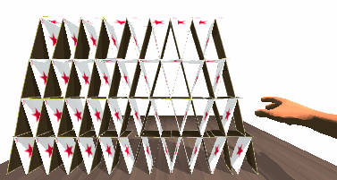
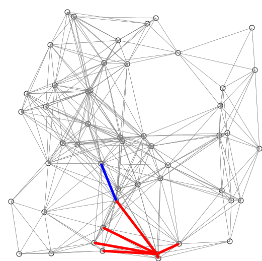
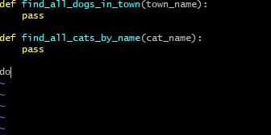
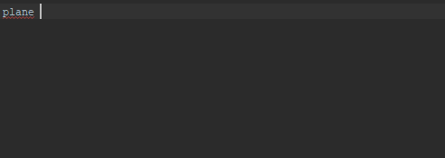
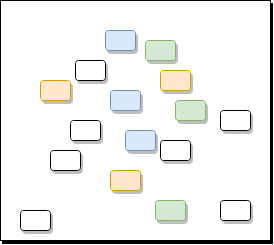
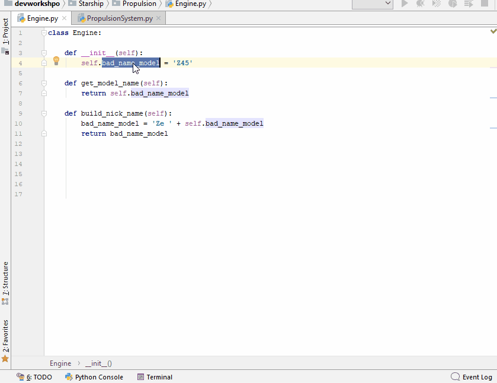
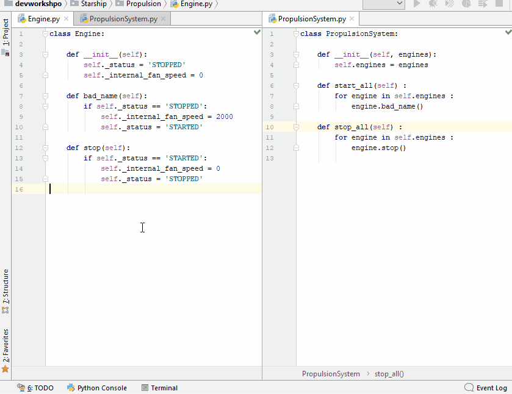
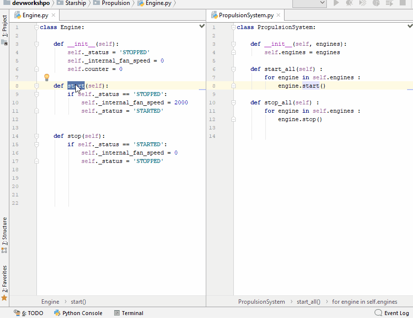
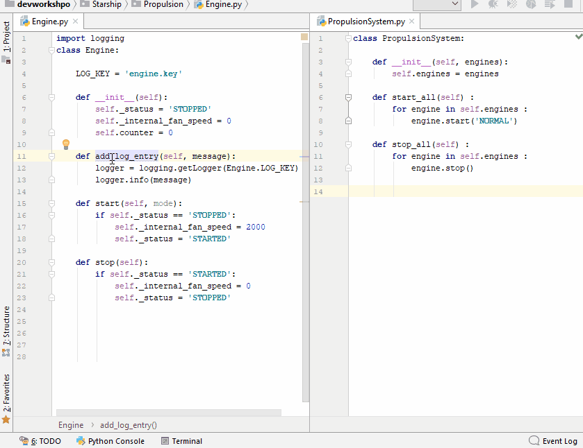

class: inverse middle center

# Titre à trouver

.footnote[marc.dexet(at)ias.u-psud.fr]

---
# Que voulez vous faire lors de ce stage ?

--
## De la physique !

Et la physique d'aujourd'hui est inséparable de l'outil informatique.

--

## Vous ne voulez pas devenir développeur !

Vous devez écrire du code python.

--

Qui fait ce que vous lui demandez.

--

Qui ne vous cache pas la physique.

--

Qui ne vous prend pas la tête.


--
.center[ .big[Il va falloir apprendre à  
se **faciliter** le code !]]

---

# Importance de son code ?

--

## C'est une représentation 

* De la physique que vous avez en tête
* Il va **évoluer** en même temps que votre vision.

--

## C'est un outil

* Rapport puissance/moyen les plus favorables.
* Peut s'avérer un terrible fardeau à trainer si négligé.

--

## C'est une production

* Partie de votre travail, 
* Un capital qui 
  * se conserve précieusement,
  * est réutilisé dans d'autres code,
  * se transmet à d'autres.
* _Désormais_ un objet scientifique au même titre qu'un article
  * _reproductibilité_

---
class: inverse middle center

# Pourquoi prendre soin de son code ?

---

# Parce que le faire fonctionner ne suffit pas

.big[.center[
Même si votre voiture **roule bien**,  
si changer une pièce cassée est quasiment _impossible_,  
c'est une voiture **nulle** !]]

<center>

</center>
---

# Parce que vous avez mieux à faire

## Votre temps est précieux
* Mettez en oeuvre vos idées plutôt que vous battre avec votre code! 

--

## Un code déplaisant ne donne pas envie de s'investir
* Un code mal fichu ne donne pas envie ni confiance
* Y compris à son auteur...

???
As a **love story**, an unpleasant code does not make you want to get involved.
Bad disposition for evolution or ease of living lower trust you put in code.

---
class: inverse middle center

# Comment se rater

Et pleurer de rage plus tard ...

<!-- ......................................................................................... -->
---

# Jouez au Docteur Frankenstein

## Créer un patchwork de trucs vus à droite et à gauche sur le net

<center>
    
</center>


<!-- ......................................................................................... -->
---

# Jouez au Docteur Frankenstein

## ... et laisser le grandir jusqu'à que ce soit lui qui vous domine.

<center>
    
</center>


<!-- ......................................................................................... -->
---

# Construisez un château de carte 

## Faites un code si fragile, si délicat et si peu testé
.medium[
.center[
Qu'il est impossible de le modifier  
sans avoir peut de tout faire  
**exploser !**
]
]

<center>

</center>

---

# Rendez votre code repoussant 

<center>

</center>
---

# Rendez votre code repoussant 

* Avec des contresens, 
* des fautes d'orthographe, 
* des commentaires faux et inutiles.

--

.outline-code-medium[
```python
     # It's not OK !!
#def rnk_ob(arr,nb):
def rank_objects(a,n,nn):
    """
    Run proces to brk A
    - param arr : array to brek
    """
        # if len(a) < 0 :
    if a and n > 0 :
    # if arr and nb > minnb :
        #   fobje = [o for o in a if fn(o) in [1,3,9]]
        # fobje = [o for o in a if len(o) == n and fn(o)]
        fobje = [o for o in a if fn(o) not in v_arr]
        # TODO call SB to get response to last mail from Sam

    return fobje

#------------------------------
# def b(f) :
#   r = F.apply(z_fn) if z_fn else 0
# WTF ??? !!
```
]

---


# Faites un code élitiste 

--

## Utilisez des expressions cryptiques que vous seul comprenez
* ... pour l'instant.

```python

a,c,d = fn_rz220(v)
if a == alpha and c == beta[d] :
    z, zz, vzz, y = c_rt_rot(t)
c = cc_rt_rotZ(d) +zz if z < Z else None
if not c : 
    c = ccc_rt_rotZ2(d) + z

```

--

## Exigez une expertise très pointue pour comprendre

--

## Ne vous remettez pas en question quand quelqu'un ne comprend pas:

.center[.huge[`"Any fool can understand this if he's good enough !"`]]

--

.center[.huge[`"(as me)"`]]


---

class: inverse middle center

# Comment se faciliter le code

et rire de bonheur (si si)!


---

class: splash center middle

# Principe #1


---

class: splash center middle black_bkg


---

class: splash center middle

Principe #1
# Code For Human

---

class: splash center

Principe #1
# Code For Human

.quote[.center[.huge[_Any fool_ can write code  
that a _**computer**_ can understand.  
]
]
]

--

.quote[.center[.huge[_Good programmers_ write code  
that _**humans**_ can understand]]
]
.right[Martin Fowler]


<!-- ......................................................................................... -->
---

# Le premier processeur, c'est le cerveau
--

## Bon points
* Il détecte les _motifs (patterns)_ , les similarités,
* Il _apprend_ , _extrapole_ and _généralise_ vite. 

--

## Mauvais points
* Une mémoire à court terme limitée 
  * _**"The Magical Number Seven, Plus or Minus Two"**_.
* Forts _biais_ cognitifs and culturels.

???
* Short-memory buffer limited to _**"The Magical Number Seven, Plus or Minus Two"**_.
You can not keep more that seven items in memory at the same time.
* What's _obvious_ for one may not be for another...

---
class: splash black_bkg

# Ne créez pas de dissonances cognitives

<center>
    
</center>

--


## Dans le code 

```python
cake = Fruit()
fruit_list = "AIRBUS-A320"
```

--

## In comments

```python
# Use the Formula  H = Epsilon / 2.0 * Sigmaz() + Delta / 2.0 * Sigmax()
h = Epsilon / 2.0 * sigmaz()
```

.footnote[.small[https://imgur.com/gallery/5Fjnaid]]

<!-- ............................................................................................ -->
---
class: splash center

# Ne surchargez pas votre cartographie mentale


<center>
    
</center>

--


.center[
Le cerveau est mauvais   
pour suivre les cheminements _complexes_  
ou garder en mémoire des  références _arbitraires_.
]


<!-- ............................................................................................ -->
---
class: splash center

# Créez de la régularité et de la consistence

.center[Le cerveau comprend vite les _motifs_ si ils sont visibles.] 

<center>
    
</center>


---

class: splash center middle

# Principe #2

<!-- ......................................................................................... -->
---
class: splash middle center

Principe #2

.huge[_Rendre_]  
--

le  
--

.huge[_code_]  
--

.huge[**LISIBLE**]    
--

!  
--

.footnote[please...]

<!-- ......................................................................................... -->
---

# Rendre le code lisible 

## Comme tout écrit, le code raconte quelque chose. 
* Il dit ce qui est fait ( le **what**) et  comment c'est fait (le **how**).

--

## Laissez le code raconter son histoire
* Plus il est **auto-descriptif**, plus il est **facile** à comprendre. 

--

## Vous lisez 10 fois plus que vous n'écrivez !

Vous écrivez _une fois_, mais vous lisez
* pour _vérifier_,
* pour _comprendre_,
* pour _vous rappeler_,
* pour _recopiez_,
--

* et pour _réécrire_ à nouveau.


---

# Rendre le code lisible 


## Donner des noms significatifs
* Les choses n'existent pas pour votre cerveau tant qu'ils ne sont pas bien nommés.

--

## Diviser votre code en petits paragraphes bien ciblés
* Pour éviter de noyer votre cerveau sous les détails !

---
class: splash middle center

Rendre le code lisible
# 1 - Nommer
pour faire exister les choses

---
class: splash middle center

Nommer
--

# Size Doesn't Matter

--

-----

.quote[.center[.huge[Vous êtes un **humain**,]]] 
--

.quote[.center[.huge[pas un **compresseur**.]]]

---
# Nommer: Size Doesn't Matter 

## Les noms trop courts surchargent la cartographie mentale

.outline-code-big[
```python
if bh :
    gooh(bh)
```
]
--

## Dialogue entre le cerveau et le code

* **Cerveau**: Oh zut ! C'est quoi déjà  .medium[`BH`]  ?
--

* **Code**: .medium[`BH`] c'est **B**lack **Hole** défini _50 lignes au-dessus_, la _semaine dernière_.
--

* **Cerveau**: Ah ouais, c'est vrai ! Mais alors c'est quoi déjà la fonction .medium[`GOOH`] ?
--

* **Code**: (soupire) G-O-O-H c'est  _**G**et_ _**O**ut_ _**O**f_ _**H**ere_... Bref **Dégage et vite** !

---
# Nommer: Comprehension Matters


.outline-code-big[
```python
if bh :
    gooh(bh)
```
]

--


.outline-code-big[
```python
if black_hole :
    get_out_of_here(black_hole)
```
]

---
# Nommer: Comprehension Matters 


## Evitez les noms de variable de une ou deux lettres
* Sauf exception pour les expressions mathématiques ou les conventions établies.

--

## Evitez les noms abrégés
* Comme .medium[`gaLocRfr`] pour .medium[`GalaxyLocationReference`].

--

## Evitez les noms imprononçables 
* Comme .medium[`crhtw`] pour _Critical Ratio Height To Weight_.
* Vous devez pouvoir en parler sans buter sur la prononciation à chaque fois.

---

## Suivez la règle "Aussi court que la portée"

* Le nom _**peut**_ ( et non  _doit_ ) être aussi court que la portée

```python
001: def collect_crews_average_size(starships):
002:    a = 0
003:    for s in starships :
004:      s = len(s.crew)
005:      a = a + s 
006:    return  a / len(starships)
007:
```

--

```python
010: starships = []
011: enterprise = Starship(name: "USS Enterprise")
012: enterprise.crew = []
013: entreprise.append( CommandingOfficer("James Tiberius Kirk"))
...
032: starships.append( entreprise )
...
182: average_crew_size = collect_crews_average_size(starships)
```

---
class: splash middle center

# "C'est sympa, mais les noms longs c'est lourd à taper."
--

Ce n'est plus une excuse valable...

---
"C'est sympa, mais les noms longs c'est lourd à taper."

# Miracle de l'*auto-completion* dans tous les bons éditeurs.

-----

.left-column[
| Editor        |    Command    |
|---------------|---------------:|
| _Vim_         |  CTRL + P / CTRL = N      |
| _EMACS_       |     TAB        |
| _Ipython/Jupyter_ |     TAB        |
| _Eclipse_     | CTRL + SPACE   |
| _PyCharm_     | CTRL + SPACE   |
| _SublimeText_  | CTRL + SPACE   |
]

.right-column[
 

]

---
class: splash middle center

Ainsi
--

.huge[Avec des noms courts  
vous n'évitez 
pas  
_les erreurs de frappe_,]
--

.huge[  
vous évitez uniquement  
**d'être compris**.
]
--

.huge[  
Utilisez des noms  
**significatifs**.
]

---
# Nommer: Suivez la convention universelle


* .medium[Objet, variable, propriété &rarr; **NOM**.] 

```python
galaxy = Galaxy()
pilot = crew.Pilot()
```

* .medium[Action, fonction, méthode &rarr; **VERBE**.]

```python
def feed_klingon(klingon):
    food = get_food_from_locker_for("klingon")
    klingon.eat(food)
```
* .medium[Collection, liste, ensemble &rarr; **PLURIEL**. ]

```python
klingons = find_klingons_in_town('groningen')
klingon_names = ['Kitty', 'Sam']
```


---
# Nommer: Suivez la convention universelle


* .medium[Dictionnaire : indiquez la *clef* pour ne pas être confondu avec les collections.]

```python
pilots_by_town['toronto']
country_to_officer_map['NL'] = find_officer_in_country('NL')
```

* .medium[Utilisez un _suffix_ si cela aide,  
surtout si votre langage est à typage dynamique.]

```python
startship_list
engine_dict
vulcan_set
```


<!-- ......................................................................................... -->
---
# Nommer: Le nom d'une fonction doit dire ce qu'elle fait

* Si on parle de  **construire**, *dite le*

```python
build_galaxy_map(source)
```

* Si on parle de  **collecter** quelque chose, *dite le*

```python
collect_life_forms_from_planets(planets)
```
## Donnez des informations utiles

```python
find_vulcans_by_name(name)

find_vulcans_by_name_in_planet(name, planet_name)

find_all_vulcans_by_planet_name(planet_name)
```


<!-- ......................................................................................... -->
---

# Nommer: Utilisez des antonymes pour refermer une action

* .medium[`begin`] &rarr; .medium[`end`]
* .medium[`open`] &rarr; .medium[`close`]
* .medium[`create`] &rarr; .medium[`destroy`]
* .medium[`start`] &rarr; .medium[`stop`]
*  ...

```python
begin_fly()
start_engine()
...
stop_engine()
end_fly()
```

---

# Les commentaires

## Nécessaires à une bonne compréhension
* Souvent le premier moyen de prendre connaissance d'un code.

## Même si c'est à destination des humains, 
* C'est aussi du code à maintenir !

--

## Code never lie, comment does
* Ne paraphraser pas le code, aucun intérêt
* Le code reste la seule source de vérité.

---

class: splash center middle

.quote[
.center[.big[Si vous avez besoin _d'améliorer les commentaires_  
pour _expliquer_ ce que fait un code compliqué,  
**améliorez le code** à la place. ]]
]

<!-- .......................................................................................... -->
---

class: splash center middle

 Make Code Readable
# 2 - Diviser votre code en petits paragraphes bien ciblés

<!-- .......................................................................................... -->

---
class: inverse black_bkg

# Coder ce n'est pas emplier des lignes de code

<center>
    
</center>

--

.big[Coder c'est répartir les responsabilité (_concerns_)].

<!--************************************************************************  -->
---
name: group_by_concerns

# Identifiez et isolez les responsabilités

<!--************************************************************************  -->
---
template: group_by_concerns

## Une _responsabilité_ correspond au **QUOI**
* Une réponse à _que fait la fonction_.

## Une _responsabilité_ ne correspond pas au **COMMENT**
* Nous ne intéressons pas encore à _comment fait la fonction_.

???
* a kind of *responsibility* to make it (very) simple.

<!--************************************************************************  -->

---
template: group_by_concerns

## Exemples de responsabilités

### L'équipage Starfleet est composé de

.outline-code-big[
```yaml
- Commanding Officer
- Navigation Officer
- Chief Of Engineering
- Communication Officer
- Science Officer
```
]

<!--************************************************************************  -->
---
template: group_by_concerns

## Exemples de responsabilités

### L'équipage Starfleet est composé de

.outline-code-big[
```yaml
*- Commanding Officer
*- Navigation Officer
- Chief Of Engineering
- Communication Officer
- Science Officer
```
]


<!--************************************************************************  -->
---
template: group_by_concerns

## Exemples de responsabilités

### Leurs responsabilités sont

.outline-code-big[
```yaml
- Commanding Officer 
*            . Prendre des décisions tactiques
*            . Diriger le vaisseau
*            . Entame des relations diplomatiques

- Navigation Officer 
*            . Localiser le vaisseau
*            . Calculer les trajectoires en mode distorsion
*            . Mettre à jour les cartes spatiales 
```
]

--

## Vous avez compris...

<!--************************************************************************  -->
---
class: splash black_bkg center

# Application à la procédure _StarShip Patrol Procedure_


<center>
    
</center>

--

Vous devez modifier la procédure     
.big[`report_starship_availability_for(patrol)`]  


--

Et ce que vous avez trouvé n'est pas vraiment _staisfaisant_.


<!--************************************************************************  -->
---
template: group_by_concerns

## Ce que vous avez trouvé


```python
def report_starship_availability_for(patrol):

    rpt = Report()
...
    avg_coms = avg_coms()
    req_qty = p.duration * avg_coms * SEC_COEFF + MIN
    if req_qty > get_nrj() :
        rpt.register('propulsion_energy','NotEnoughEnergy',CRITICAL)

    t_rep = 0
    for eng in get_engs():
        fails = get_fails(engine) 
        t_rep = t_rep + eval_rep_time(eng, fails)
    if t_rep > ( now() - p.departure ):
        rpt.register('engine_check','ReparationTooLong',CRITICAL)
...

    if rpt.find_issues_by_level(CRITICAL) :
        status = NOT_AVAILABLE
    else
        status = evaluate_risks_from_report(rpt)

    rpt.set_status(status)
    return rpt 
```

<!--************************************************************************  -->
---
template: group_by_concerns

## Focalisons nous sur ces lignes de code 


```python
def report_starship_availability_for(p):

    report = Report()
...
*   avg_coms = avg_coms()
*   req_qty = p.duration * avg_coms * SEC_COEFF + MIN
*   if req_qty > get_nrj() :
*       rpt.register('propulsion_energy','NotEnoughEnergy',CRITICAL)
*
*   t_rep = 0
*   for eng in get_engs():
*       fails = get_fails(engine) 
*       t_rep = t_rep + eval_rep_time(eng, fails)
*   if t_rep > ( now() - p.departure ):
*       rpt.register('engine_check','ReparationTooLong',CRITICAL)
...

    if report.find_issues_by_level(CRITICAL) :
        status = NOT_AVAILABLE
    else
        status = evaluate_risks_from_report(report)

    report.set_status(status)
    return report 
```

<!--************************************************************************  -->
---
template: group_by_concerns

## Identifiez les blocs de code 


```python
...
    avg_coms = avg_coms()
    req_qty = p.duration * avg_coms * SEC_COEFF + MIN
    if req_qty > get_nrj() :
        rpt.register('propulsion_energy','NotEnoughEnergy',CRITICAL)

    t_rep = 0
    for eng in get_engs():
        fails = get_fails(engine) 
        t_rep = t_rep + eval_rep_time(eng, fails)
    if t_rep > ( now() - p.departure ):
        rpt.register('engine_check','ReparationTooLong',CRITICAL)
...
```

--

.medium[_Oh, désolé, c'est la version compressée..._]

<!--************************************************************************  -->
---
template: group_by_concerns

## Identifiez les blocs de code

```python
...
    average_energy_per_day = get_average_propulsion_energy_consumption_per_day()
    required_energy_level = patrol.duration * average_energy_per_day * SECURITY_COEFF + MINIMAL
    if required_energy_level > get_actual_stocked_energy() :
        report.register('propulsion_energy','NotEnoughEnergy', CRITICAL)

    time_repair = 0
    for engine in get_engines():
        failures = get_failures(engine) 
        time_repair = time_repair + evaluate_reparation_time(engine, failures)
    if time_repair > ( now() - patrol.departure ):
        report.register('engine_check','ReparationTooLong', CRITICAL)
...
```

<!--************************************************************************  -->
---
template: group_by_concerns

## Commentez les blocs de code

```python
    #-- Check propulsion energy against patrol duration --
    average_energy_per_day = get_average_propulsion_energy_consumption_per_day()
    required_energy_level = patrol.duration * average_energy_per_day * SECURITY_COEFF + MINIMAL
    if required_energy_level > get_actual_stocked_energy() :
        report.register('propulsion_energy','NotEnoughEnergy', CRITICAL)
        
    #-- Check engines reparation delay against patrol departure -- 
    time_repair = 0
    for engine in get_engines():
        failures = get_failures(engine) 
        time_repair = time_repair + evaluate_reparation_time(engine, failures)
    if time_repair > ( now() - patrol.departure ):
        report.register('engine_check','ReparationTooLong', CRITICAL)
...
```

???

After a little investigation, you found out the mening of these blocks.

<!--************************************************************************  -->
---
template: group_by_concerns

## Commentez les blocs de code

```python
*   #-- Check propulsion energy against patrol duration --
    average_energy_per_day = get_average_propulsion_energy_consumption_per_day()
    required_energy_level = patrol.duration * average_energy_per_day * SECURITY_COEFF + MINIMAL
    if required_energy_level > get_actual_stocked_energy() :
        report.register('propulsion_energy','NotEnoughEnergy', CRITICAL)
        
*   #-- Check engines reparation delay against patrol departure -- 
    time_repair = 0
    for engine in get_engines():
        failures = get_failures(engine) 
        time_repair = time_repair + evaluate_reparation_time(engine, failures)
    if time_repair > ( now() - patrol.departure ):
        report.register('engine_check','ReparationTooLong', CRITICAL)
...
```
--

## Vous avez répondu à _QUE FONT-ILS ?_ : 
 * _Checking propulsion energy against patrol duration._
 * _Checking engine reparation delay against patrol departure._

<!--************************************************************************  -->
---
template: group_by_concerns

## Vous avez identifié deux responsabilités : 

* .medium[`checking propulsion energy against patrol duration`]

```python
*   #-- Check propulsion energy against patrol duration --
    average_energy_per_day = get_average_propulsion_energy_consumption_per_day()
    required_energy_level = patrol.duration * average_energy_per_day * SECURITY_COEFF + MINIMAL
    if required_energy_level > get_actual_stocked_energy() :
        report.register('propulsion_energy','NotEnoughEnergy', CRITICAL)
```
* .medium[`checking engine reparation delay against patrol departure`]

```python
*   #-- Check engines reparation delay against patrol departure --
    time_repair = 0
    for engine in get_engines():
        failures = get_failures(engine) 
        time_repair = time_repair + evaluate_reparation_time(engine, failures)
    if time_repair > ( now() - patrol.departure ):
        report.register('engine_check','ReparationTooLong', CRITICAL)
```

<!--************************************************************************  -->
---
template: group_by_concerns

## Isolez ces responsabilités comme des fonctions

* .medium[`checking propulsion energy against patrol duration`]

```python
def check_propulsion_energy_against_duration(report, patrol_duration):
    average_energy_per_day = get_average_propulsion_energy_consumption_per_day()
    required_energy_level = patrol_duration * average_energy_per_day * SECURITY_COEFF + MINIMAL
    if required_energy_level > get_actual_stocked_energy() :
        report.register('propulsion_energy','NotEnoughEnergy', CRITICAL)
```
* .medium[`checking engine reparation delay against patrol departure`]

```python
def check_engines_reparation_delay_against_departure(report, patrol_departure):
    time_repair = 0
    for engine in get_engines():
        failures = get_failures(engine) 
        time_repair = time_repair + evaluate_reparation_time(engine, failures)
    if time_repair > ( now() - patrol_departure ):
        report.register('engine_check','ReparationTooLong', CRITICAL)
```
<!--************************************************************************  -->
---
template: group_by_concerns

## Isolez ces responsabilités comme des fonctions


.medium[Vous pouvez distinguer le **QUOI**...]

```python
*def check_propulsion_energy_against_duration(report, patrol_duration):

    average_energy_per_day = get_average_propulsion_energy_consumption_per_day()
    required_energy_level = patrol_duration * average_energy_per_day * SECURITY_COEFF + MINIMAL
    if required_energy_level > get_actual_stocked_energy() :
        report.register('propulsion_energy','NotEnoughEnergy', CRITICAL)
```
--

.medium[...du **COMMENT**]
```python
def check_propulsion_energy_against_duration(report, patrol_duration):

*    average_energy_per_day = get_average_propulsion_energy_consumption_per_day()
*    required_energy_level = patrol_duration * average_energy_per_day * SECURITY_COEFF + MINIMAL
*    if required_energy_level > get_actual_stocked_energy() :
*        report.register('propulsion_energy','NotEnoughEnergy', CRITICAL)
```


<!--************************************************************************  -->
---
template: group_by_concerns

## Utilisation  
```python
def report_starship_availability_for(patrol):

    report = Report()
...
    #-- Check propulsion energy against patrol duration --
    check_propulsion_energy_against_duration(report, patrol.duration)

    #-- Check engines reparation delay against patrol departure --
    check_engines_reparation_delay_against_departure(report, patrol.departure)
...

    if report.find_issues_by_level(CRITICAL) :
        status = NOT_AVAILABLE
    else
        status = evaluate_risks_from_report(report)

    report.set_status(status)
    return report 
```

???

Does it needs comments to understand ?
<!--************************************************************************  -->
---
template: group_by_concerns

## Utilisation  
```python
def report_starship_availability_for(patrol):

    report = Report()
...
    check_propulsion_energy_against_duration(report, patrol.duration)

    check_engines_reparation_delay_against_departure(report, patrol.departure)
...

    if report.find_issues_by_level(CRITICAL) :
        status = NOT_AVAILABLE
    else
        status = evaluate_risks_from_report(report)

    report.set_status(status)
    return report 
```

--

Pouvez-vous le lire à haute voix ?

<!--************************************************************************  -->

---
name: why_the_separation_of_concern_is_more_satisfying 

# Pourquoi est-ce mieux ?

.outline-code-medium[

```python

def report_starship_availability_for(patrol):
...
    check_propulsion_energy_against_duration(report, patrol.duration)

    check_engines_reparation_delay_against_departure(report, patrol.departure)
...
```
]

<!--************************************************************************  -->
---
template: why_the_separation_of_concern_is_more_satisfying 

# Plus lisible

--

.outline-code-medium[
```python
def report_starship_availability_for(patrol):
...
    average_energy_per_day = get_average_propulsion_energy_consumption_per_day()
    required_energy_level = patrol.duration * average_energy_per_day * SECURITY_COEFF + MINIMAL
    if required_energy_level > get_actual_stocked_energy() :
        report.register('propulsion_energy','NotEnoughEnergy', CRITICAL)
    time_repair = 0

    for engine in get_engines():
        failures = get_failures(engine) 
        time_repair = time_repair + evaluate_reparation_time(engine, failures)
    if time_repair > ( now() - patrol.departure ):
        report.register('engine_check','ReparationTooLong', CRITICAL)
...
```
]

<!--************************************************************************  -->
---
template: why_the_separation_of_concern_is_more_satisfying 

# Plus lisible

* Je peux comprendre **COMMENT** _la vérification des systèmes du vaisseau_ est réalisée _avant_ une patrouille,
--

 * Au premier regard,
--

 * Sans être noyé par les détails. 
--

 * Mon cerveau adore !

<!--************************************************************************  -->
---
template: why_the_separation_of_concern_is_more_satisfying 

# Les responsabilités sont clairement définies
* J'ai une réponse claire à la question  
_"Qui est chargé de la vérification du niveau d'énergie de cette satanée propulsion ?"_

.outline-code-medium[
```python
* def check_propulsion_energy_against_duration(report, patrol_duration):
    average_energy_per_day = get_average_propulsion_energy_consumption_per_day()
    required_energy_level = patrol_duration * average_energy_per_day * SECURITY_COEFF + MINIMAL
    if required_energy_level > get_actual_stocked_energy() :
        report.register('propulsion_energy','NotEnoughEnergy', CRITICAL)
```
]

<!--************************************************************************  -->
---
template: why_the_separation_of_concern_is_more_satisfying 

# Chaque partie peut être testée isolemment 
* Plutôt que de tester toute la function .medium[`report_starship_availability_for`].

.left-column[
.outline-code-medium[
```python
def test_without_energy_level():
    # given 
    mock_it('get_actual_stocked_energy', value=0)

    # when
    check_propulsion_energy_against_duration(report, duration)

    # then
    assert 'propulsion_energy.NotEnoughEnergy' in report
```
]
]

.right-column[
.outline-code-medium[
```python
def test_with_very_long_duration():
    # given 
    duration = 3 * YEAR

    # when
    check_propulsion_energy_against_duration(report, duration)

    # then
    assert 'propulsion_energy.NotEnoughEnergy' in report
```
]
]

---
class: middle center

# Isoler les responsabilités


<!-- ......................................................................................... -->
---
class: splash middle center

# Principe #3


<!-- ......................................................................................... -->
---
class: splash middle center

Principe #3

# Diviser pour mieux régner
et garder le contrôle


<!-- .......................................................................................... -->
---
# Diviser pour mieux régner

## Small is pretty 
* Des petits blocs isolés sont plus facile à changer
* Evitez la _God function_ de 300 lignes, là où tout est définit et impénétrable.


--

## Délimiter très clairement les responsabilités
* Avec des composants bien définis, des responsabilités limitées et claires.

--

## Séparer les niveaux d'abstraction
* Mettez en valeur ce qui est important ou fondamental dans votre code.
* Montrez ce que vous voulez obtenir avant de montrer comment.

.center[.big[.quote[Limiter les réactions en chaîne   
et les effets de bord à chaque changement.]]]


<!-- .......................................................................................... -->
---
# Mettre les choses en ordre

## Le cerveau recherche des motifs, donnez en lui avant qu'il n'en invente
<center>
    
</center>


<!-- .......................................................................................... -->
---
# Mettre les choses en ordre

## Créer un ordre cohérent sans dissonance

* Comme une maison ou un atelier, rangez les choses dans des lieux **sans surprise, usuel** pour les retrouver **sans effort**.

<center>
    
</center>

<!-- .......................................................................................... -->
---

# Utilisez les Packages, Modules, Namespace

## Séparer les différents domaines

.outline-code-qbig[
```python
from starship.systems import navigation

from cartography import maps

from crew.roles import navigator

...
```
]

---
class: splash 

# .center[Golden Rule For Function]

--

.quote[.center[.big[Une fonction _doit_ **faire une chose.**  
Elle doit le faire **bien**.  
Elle doit n'en faire **qu'une seule**.  ]]]  


---
class: splash 

# .center[Golden Rule For Function]


.reset-column[]

.left-column[
```python
def engine_start():
    engine_status = 'STARTED'
    if not engine_logger :
       FORMAT = '%(asctime)-15s %(message)s'
       logging.basicConfig(format=FORMAT)
       engine_logger = logging.getLogger('engine')
    engine_logger.info('Engine started')
    engine_power = 0.1


...        
```
]

---
class: splash 

# .center[Golden Rule For Function]


.reset-column[]

.left-column[
```python
*def engine_start():
*    engine_status = 'STARTED'
    if not engine_logger :
       FORMAT = '%(asctime)-15s %(message)s'
       logging.basicConfig(format=FORMAT)
       engine_logger = logging.getLogger('engine')
    engine_logger.info('Engine started')
*    engine_power = 0.1


...        
```
]

.right-column[
.center[
* Démarrage du moteur
]
]


---
class: splash 

# .center[Golden Rule For Function]


.reset-column[]

.left-column[
```python
def engine_start():
    engine_status = 'STARTED'
*    if not engine_logger :
*       FORMAT = '%(asctime)-15s %(message)s'
*       logging.basicConfig(format=FORMAT)
*       engine_logger = logging.getLogger('engine')
*    engine_logger.info('Engine started')
    engine_power = 0.1


...        
```
]

.right-column[
.center[
* Démarrage du moteur
* Création et utilisation d'un logger. 
]
]

.reset-column[]

.center[.big[Cette fonction ne fait pas une chose et une seule !]]
<!-- .......................................................................................... -->
---
class: splash 

# .center[Golden Rule For Function]

* Concentrons sur la fonction (_démarrer le moteur_)
* **Déléguons** la gestion de logger à une autre fonction (_log_info_).


.reset-column[]

.left-column[
```python
def engine_start():
    engine_status = 'STARTED'
*    if not engine_logger :
*       FORMAT = '%(asctime)-15s %(message)s'
*       logging.basicConfig(format=FORMAT)
*       engine_logger = logging.getLogger('engine')
*    engine_logger.info('Engine started')
    engine_power = 0.1


...        
```

]

--

.right-column[
```python


def engine_start():
    engine_status = 'STARTED'
*   log_info('Engine started')
    engine_power = 0.1
```
]

.reset-column[]

---
class: splash 

# .center[Golden Rule For Function]

* Concentrons sur la *nouvelle* fonction (_écrire dans le log_)
* **Déléguons** la gestion de la création (ou non) du logger à une autre fonction (_get_logger_).


.reset-column[]

.left-column[
```python
def engine_start():
    engine_status = 'STARTED'
*    if not engine_logger :
*       FORMAT = '%(asctime)-15s %(message)s'
*       logging.basicConfig(format=FORMAT)
*       engine_logger = logging.getLogger('engine')
*    engine_logger.info('Engine started')
    engine_power = 0.1


...        
```

]

.right-column[
```python


def log_info(msg):
*   get_logger().info(msg)  

def engine_start():
    engine_status = 'STARTED'
    log_info('Engine started')
    engine_power = 0.1
```
]

.reset-column[]
<!-- .......................................................................................... -->
---
class: splash 

# .center[Golden Rule For Function]

.reset-column[]

.left-column[
```python
def engine_start():
    engine_status = 'STARTED'
     if not engine_logger :
        FORMAT = '%(asctime)-15s %(message)s'
        logging.basicConfig(format=FORMAT)
        engine_logger = logging.getLogger('engine')
     engine_logger.info('Engine started')
    engine_power = 0.1


...        
```
]


.right-column[
```python
def get_logger():
    if not engine_logger :
       FORMAT = '%(asctime)-15s %(message)s'
       logging.basicConfig(format=FORMAT)
       engine_logger = logging.getLogger('engine')
    return engine_logger

def log_info(msg):
    get_logger().info(msg)    

def engine_start():
    engine_status = 'STARTED'
    log_info('Engine started')
    engine_power = 0.1
```
]

.reset-column[]

Au final nous avons 3 fonctions
* qui chacune est responsable de faire une chose et une seule,
* de le faire bien,
* d'être réutilisable.

---
class: splash middle center

# Principe #4

<!-- ......................................................................................... -->
---

class: splash middle center

Principe #4
# Equipez vous !


<!-- ......................................................................................... -->
---
name: dont_be_afraid

# N'ayez pas peur de transformer votre

.left-column[
.center[
## Le code n'est pas une construction délicate  
]

<center>
    
</center>
]

???
If you have a good design, follow strong principes, your code is not a fragile building.

--

.right-column[
.center[
## Le code est comme une pate à pain.
]

<center>
    
</center>
]


.reset-column[]

???
* You have to reshape, cut off, make parts at any time.


--

.center[.medium[.quote[Si vous ne pouvez pas  ]]]
--

.center[.big[.quote[renommer une variable, déplacer une fonction, or changer ses arguments  ]]]
--

.center[.medium[.quote[et ainsi de suite...  ]]]
--

.center[.huge[.quote[parce que **ce n'est pas si facile**.  ]]]
--

.center[.quote[Bien  ]]
--

.center[.huge[.quote[Vous êtes juste **sous-équipé.**]]]

---


# Tirer avantage des outils

## N'essayez pas de tout garder en tête
* Vous vous surchargez inutilement

<center>
    
</center>

<!-- ......................................................................................... -->
---
name: use_powerful_editor

# Utilisez un vrai éditeur

---
template: use_powerful_editor

## Le meilleur éditeur est celui que l'on maîtrise, mais...
1. Cela prends du temps de **vraiment** le maîtriser.
1. Il n'est peut-être pas le plus adpaté

--

## Allez au-delà du simple éditeur de texte
* .big[.quote["Je connais un type il arrive à développer avec un simple éditeur de texte !"]]
--

* .big[.quote["Moi je connais quelqu'un qui calcule des logarithmes de tête."]]
--

* .big[.quote["C'est possible, mais il y a plus efficace."]]


<!-- .......................................................................................... -->
---
template: use_powerful_editor


- &#9744;  **Assistant orienté language**
   * &#9744; Syntax Highlight et Auto-completion
   * &#9744; Analyse permanente du code ( _linter_ )
--

- &#9744;  **Debuggeur visuel facile** 
   * &#9744; pas-à-pas
   * &#9744; avec exploration des valeurs et modification
--

- &#9744;  **Refactoring**
   * &#9744; renommage (variable, fonction, méthode, classe, package, ...)
   * &#9744; changement de signature (paramètre, nom et ordre)
   * &#9744; déplacement (fonction, méthode, classe, package, ...)
--

- &#9744;  **Navigation**
   * &#9744; Affichage de la structure (Outline)
   * &#9744; Saut rapide à la définition, déclaration...
   * &#9744; Usages

<!-- .......................................................................................... -->
---
template: use_powerful_editor

## Les bons éditeurs gardent tout en mémoire
* Ce sera toujours plus **rapide** et **efficace** que vous.
* Il maintient un index de tous les symboles, fonctions, classes.

--

## Exemple de ces capacités

---
## Renommer une variable

<center>
    
</center>
---
## Renommer une fonction

<center>
    
</center>


---
## Changer une signature

<center>
    
</center>


---
## Déplacer une function

<center>
    
</center>

---
class: inverse middle center

# Conclusion
## Coder pour les humains
## Rendre le code lisible
## Diviser pour mieux régner
## Equipez vous !


<!-- ......................................................................................... -->
---

class: splash center
# Code for Human


.center[ .huge[
Always code as  
if the person  
who ends up maintaining your code  
is a violent **psychopath**  
who knows where you live.]]


<!-- ......................................................................................... -->
---

class: splash center
# Code for Human


